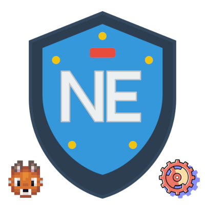

# NeoEssentials



[](https://www.minecraft.net/)
[](https://neoforged.net/)
[](https://opensource.org/licenses/MIT)
[]()
[](https://discord.gg/dUGAQF2Mga)

> NeoEssentials is a comprehensive, config-driven essentials mod for Minecraft NeoForge 1.21.1 servers. It provides 50+ commands, GUI tools, advanced administration, and a real-time web dashboard—all managed by modular JSON config files and standardized documentation.

## 🌟 Overview

NeoEssentials brings essential server management, player utilities, and advanced admin features to NeoForge servers. All features are strictly documented and driven by config files for reliability and transparency.

**Server-Side Only**: No client install required—works with vanilla clients.
**50+ Commands**: Covers all major server functions, utilities, and moderation.
**Modern UI**: GUI commands, color code support, and web dashboard.

## ✨ Core Systems & Features

- **Economy System**: Player balances, payments, kits, and shop support.
- **Chat & Messaging**: Private messages, mail, ignore/socialspy, AFK system.
- **Moderation**: Ban, kick, mute, jail, vanish, freeze, sudo, player data.
- **Teleportation**: Homes, warps, spawn, teleport requests, back system.
- **Kit Management**: Configurable item kits with cooldowns and preview.
- **Web Dashboard**: Real-time server monitoring, config editing, API endpoints.
- **Permission System**: LuckPerms, FTB Ranks, and built-in support.
- **Item Management**: Item spawning, repair, enchant, clearinventory, powertool.
- **Utility Systems**: Nicknames, MOTD, near, ping, depth, helpop, rules, suicide, etc.
- **API & Placeholder System**: PlaceholderAPI integration, custom placeholders, REST API endpoints.

## 📖 Documentation

Start at [docs/Home.md](docs/Home.md) for a complete, config-driven documentation hub. All major systems are documented:
  - Economy, Chat, Moderation, Teleportation, Kits, Web Dashboard, Permissions, Item Management, Utility, API & Placeholder
  - Each system's Markdown file is standardized and matches the codebase/config
  - See [docs/APISystem.md](docs/APISystem.md) for API & Placeholder System details, including:
    - PlaceholderAPI integration for dynamic text
    - Custom and expansion placeholders
    - Web Dashboard REST API endpoints for server status, player info, logs, config, events, and statistics
    - Permissions and config options for API features

## 🚀 Quick Start

### Installation
1. Download the latest release (neoessentials-1.0.2.2_HOTFIX.jar)
2. Place the JAR file in your server's `mods` folder
3. Start your server to generate configuration files in `config/neoessentials/`
4. Configure permissions and features as needed
5. Restart the server to apply changes

### Essential Configuration Files
```
config/neoessentials/
├── config.json           # Main configuration settings
├── permissions.json      # Permission system setup
├── language/            # Language files directory
├── shops.json           # Shop system configuration
└── settings.json        # Additional mod settings
```

### Quick Permission Setup
For LuckPerms users:
```
/lp group admin permission set neoessentials.admin true
/lp group moderator permission set neoessentials.moderator true
/lp group default permission set neoessentials.player true
```

## 🎮 Command Reference

See [docs/Home.md](docs/Home.md) and individual system docs for full command lists and config options.

## 🔧 Configuration Examples

All features are managed by modular JSON config files. See [docs/Home.md](docs/Home.md) and system docs for details.

## 🔗 API Integration for Modders

See [docs/APISystem.md](docs/APISystem.md) for full API and PlaceholderAPI documentation, including:
- Registering custom placeholders
- Using REST API endpoints for server data
- Economy API for mod integration

## 🔗 Integration & Compatibility

- **LuckPerms** and **FTB Ranks** supported
- **Server-Side Only** (no client mods required)
- **Vanilla Client Support**
- **Performance Optimized**

## 🤝 Support & Community

- **Discord**: [Join our Discord server](https://discord.gg/dUGAQF2Mga) for support and community discussion
- **Bug Reports**: Report issues and bugs through GitHub or Discord
- **Feature Requests**: Suggest new features and improvements
- **Documentation**: See [docs/Home.md](docs/Home.md) and system docs

## 📄 License

NeoEssentials is licensed under the MIT License. See the [LICENSE](LICENSE) file for details.

---

**🌟 Ready to enhance your server? Download NeoEssentials and give your players the essential tools they need!**

*Made with ❤️ for the Minecraft community*
